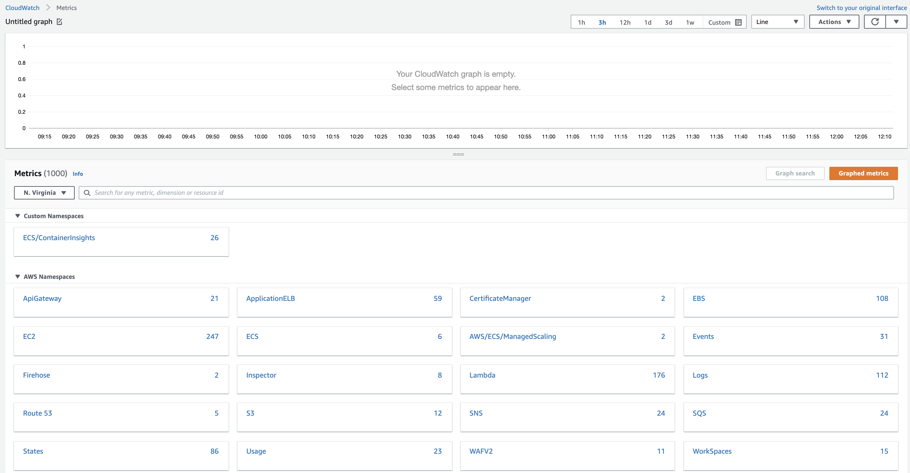
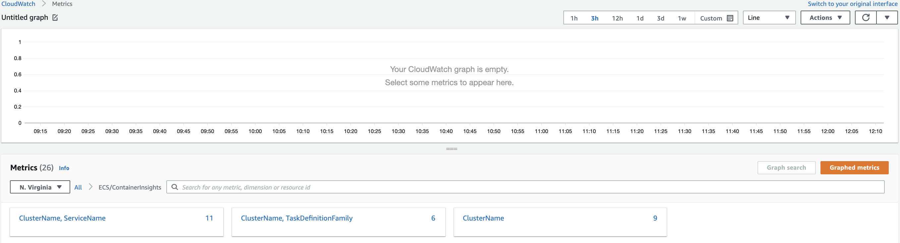
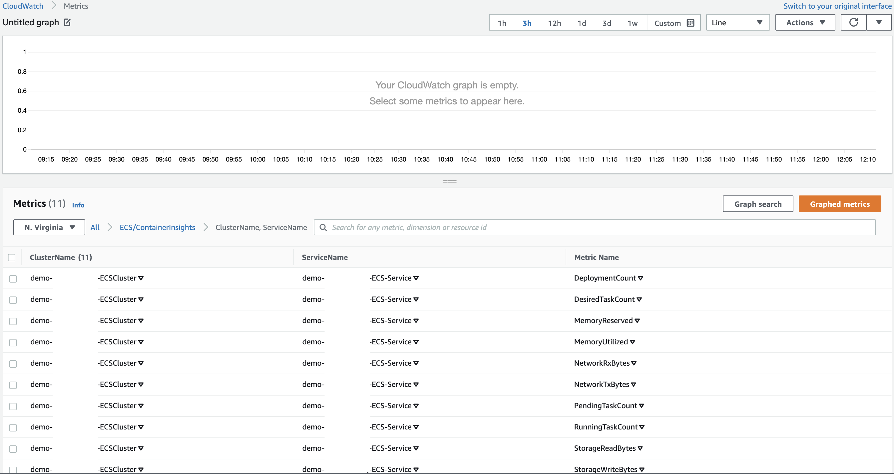
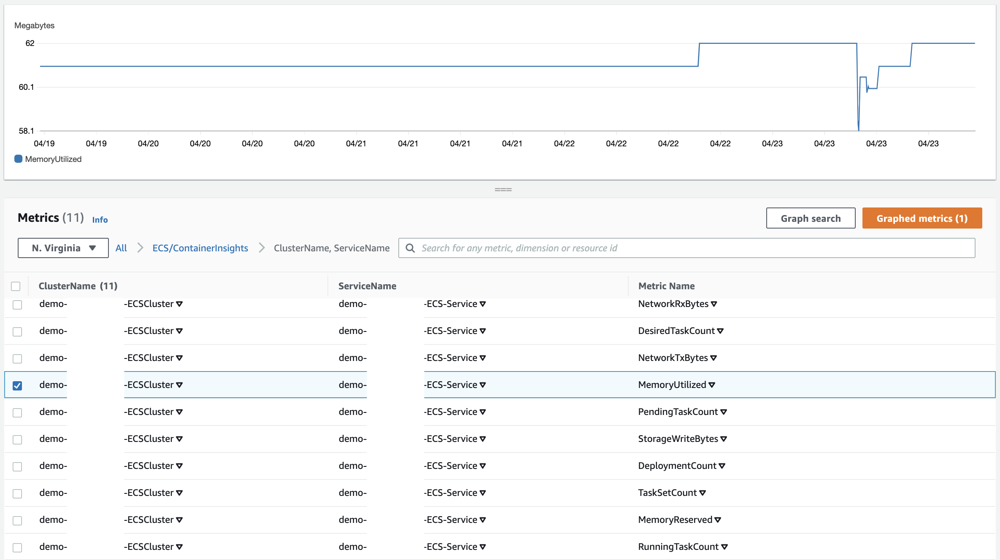
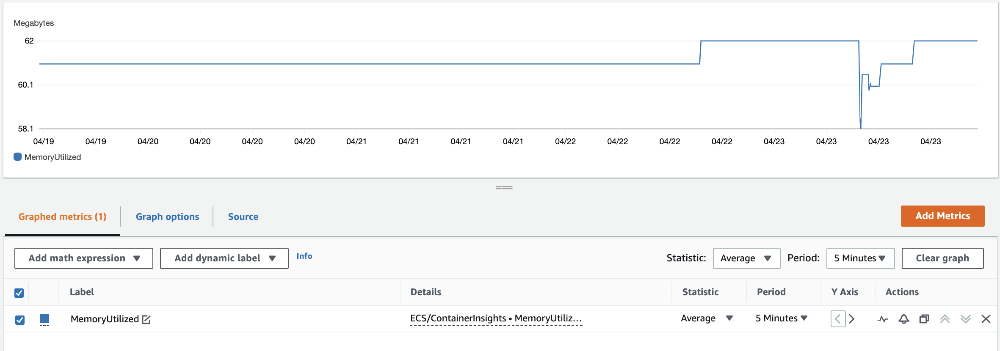
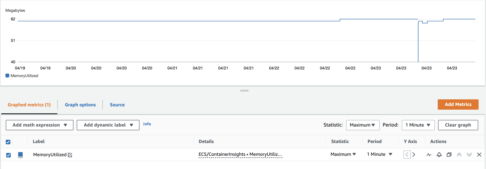

## AWS Cloudwatch Metrics

**Introduction**

- Metrics are information around the performance of the systems. 

- Out of the box a few AWS services offer metrics at no cost for resources such as Ec2, EBS, and RDS. We can also switch to detailed monitoring for a couple of resources such as Ec2 to fetch more details around the performances, and the best thing is we can publish our own application metrics. 

- Amazon CloudWatch ingests all the metrics in the AWS account (both AWS resource metrics and application metrics) for searching, graphing, and alarms.

- Metric data is kept for 15 months, allowing us to view both up-to-the-minute data and historical data.

- In this tutorial we will explore around 
  -  Viewing Cloudwatch metrics
  -  Applying Math expression 
  -  Understanding Metrics Explorer

- Step 1: Viewing Cloudwatch metrics

   1. Traverse to the <a href="https://console.aws.amazon.com/pinpoint/">CloudWatch</a> select Metrics

       
      
       
           
   2. Select ECS/ContainerInsights namespace, it contains all the metrics captured by CloudWatch Container Insights from the ECS clusters that have Container Insights enabled.
     
       
     
   3. Select the ClusterName, ServiceName, if there are multiple ECS cluster in the account, then we will see all the cluster names listed there
     
       
   
   4. Select the checkbox next to a metric to add it to the graph
     
       
   
   5. Select on the Graphed metrics tab, we can change the metric statistic by selecting on the statistic type as shown below
     
       
   
   6. Container Insights captures metrics at 5 minute interval by default. In order to see granular data graphed, change the Period to 1 Minute
   
       

- Step 2: Applying Math expression 

- Step 3: Understanding Metrics Explorer
