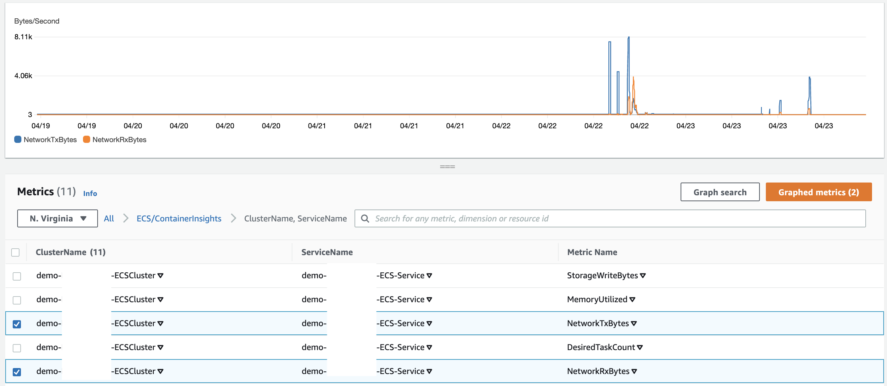
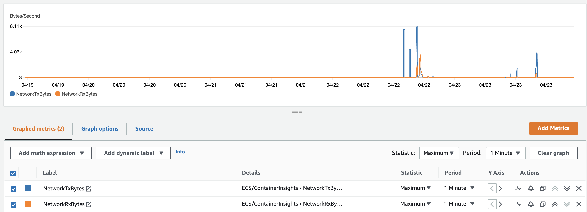
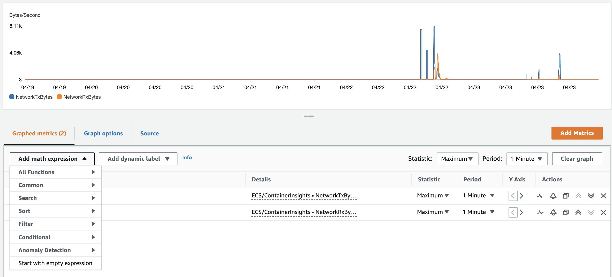
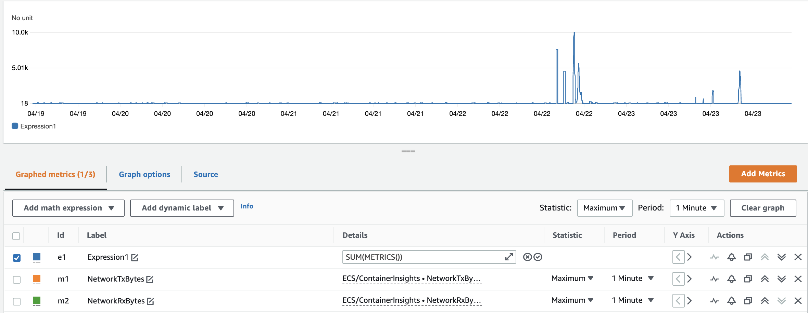
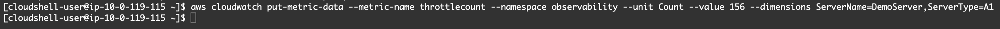
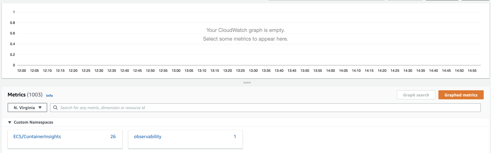
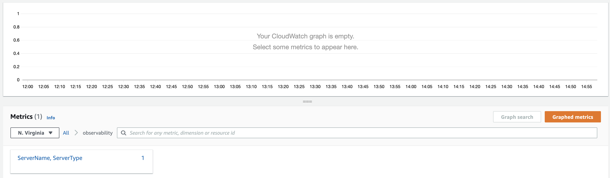
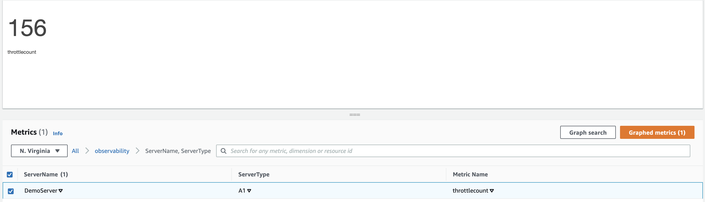

## AWS Cloudwatch Metrics

**Introduction**

- Metrics are information around the performance of the systems. 

- Out of the box a few AWS services offer metrics at no cost for resources such as Ec2, EBS, and RDS. We can also switch to detailed monitoring for a couple of resources such as Ec2 to fetch more details around the performances, and the best thing is we can publish our own application metrics. 

- Amazon CloudWatch ingests all the metrics in the AWS account (both AWS resource metrics and application metrics) for searching, graphing, and alarms.

- Metric data is kept for 15 months, allowing us to view both up-to-the-minute data and historical data.

- In this tutorial we will explore around 
  
  -  Viewing Cloudwatch metrics
  
  -  Applying Math expression 
  
  -  Publish custom metrics

- Step 1: Viewing Cloudwatch metrics

   1. Traverse to the <a href="https://console.aws.amazon.com/cloudwatch/">CloudWatch</a> select Metrics

       
      
       
           
   2. Select ECS/ContainerInsights namespace, it contains all the metrics captured by CloudWatch Container Insights from the ECS clusters that have Container Insights enabled.
     
       
     
   3. Select the ClusterName, ServiceName, if there are multiple ECS cluster in the account, then we will see all the cluster names listed there
     
       
   
   4. Select the checkbox next to a metric to add it to the graph
     
       
   
   5. Select on the Graphed metrics tab, we can change the metric statistic by selecting the statistic type as shown below
     
       
   
   6. Container Insights captures metrics at the 5-minute intervals by default. In order to see granular data graphed, change the Period to 1 Minute
   
       

- Step 2: Applying Math expression 

    - Metric math allow us to query multiple CloudWatch metrics and leverage math expressions to create new time series based on these metrics. 
    
    - We can also present the resulting time series on the CloudWatch console and embed them to the dashboards
    
        1. Traverse to the <a href="https://console.aws.amazon.com/cloudwatch/">CloudWatch</a> select Metrics

             

             
           
        2. Select ECS/ContainerInsights namespace, it contains all the metrics captured by CloudWatch Container Insights from the ECS clusters that have Container Insights enabled.
     
             
     
        3. Select the ClusterName, ServiceName, if there are multiple ECS cluster in the account, then we will see all the cluster names listed there

             

        4. Select all the checkbox next to a metric to add it to the graph

             

        5. Select on the Graphed metrics tab

             

        6. Select math expression, then All functions, followed by SUM.

             

             

    **Note**: There are multiple expressions available to operate on Metric data, to view all expressions click on Math expression and check out the various functions available
      
- Step 3: Publish custom metrics
    
  - We can embed our own custom metrics in multiple different ways

      - <a href="https://docs.aws.amazon.com/AmazonCloudWatch/latest/monitoring/publishingMetrics.html">AWS CLI</a>

      - <a href="https://docs.aws.amazon.com/cli/latest/reference/cloudwatch/put-metric-data.html">put-metric-data API call</a>

      - <a href="https://observability.workshop.aws/en/emf.html">Embedded Metric Format</a>
   
  - In this example, we will use the AWS CLI to embed a metric called throttlecount under the dimension ServerName, ServerType to the observability namespace

       1. Run the below command on CloudShell or on your own terminal

              aws cloudwatch put-metric-data --metric-name throttlecount --namespace observability --unit Count --value 156 --dimensions ServerName=DemoServer, ServerType=A1

             
           
       2. Traverse to the <a href="https://console.aws.amazon.com/cloudwatch/">CloudWatch</a> select Metrics
       
       3. Select observability namespace and then select ServerName, ServerType
      
            
            
             
     
       4. Here we should see the custom metric that we just published.

             
